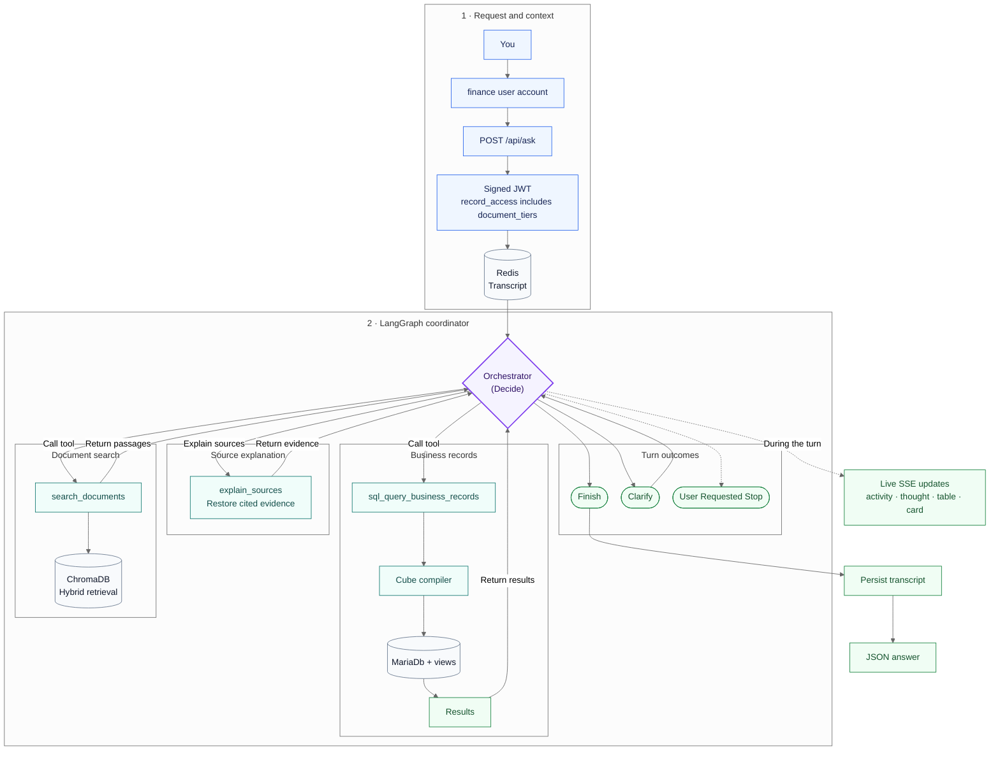
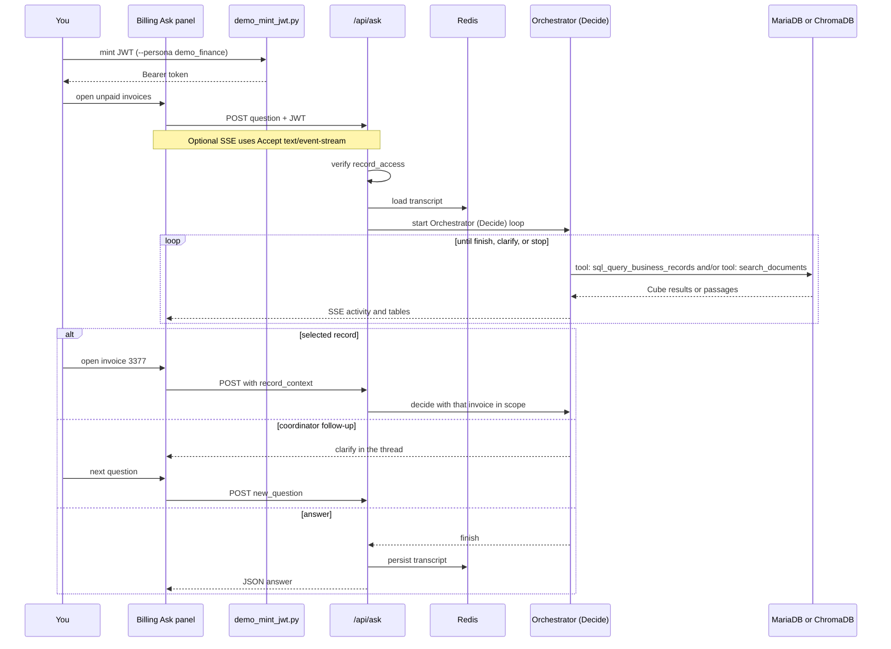

# MCP Assistant Demo

Natural-language questions over a print-shop billing database, compiled through
versioned business-definition bundles, plus grounded document Q&A with citations.

- **Structured SQL analytics** — JWT-gated queries against MariaDB views (`data/mcp_demo_v2.sql.gz`).
- **Fail-closed access** — the same question can answer for `demo_finance` and refuse for `demo_production`.
- **Grounded document Q&A** — retrieve from the bundled handbook and cite sources.

This is a demo distilled from the original app. 

## Architecture

A finance user asks who owes us, opens an invoice, then asks about that selected record.
This repository is the Ask API. The [record-links replay](docs/replays/demo-s2-who-owes-us.mp4) is the billing panel that calls it.



LangGraph `Orchestrator (Decide)` owns the turn. It calls `tool: sql_query_business_records`, `tool: search_documents`, or `explain_sources`, then loops until it finishes, clarifies, or stops.
`tool: sql_query_business_records` runs MariaDB through a Cube compiler to results. `tool: search_documents` retrieves from ChromaDB with hybrid retrieval. `explain_sources` restores cited evidence. It is not a catalog tool.
SSE frames go out while the loop runs. The transcript is written after the turn ends.
This demo sets `CONVERSATION_COORDINATOR_ENABLED=true`.

## Ask flow



You mint a JWT, then ask from the billing panel or from `/api/ask`.
If you open a row, the next question carries that record.
The coordinator can ask a follow-up in the same thread.

## Try these

| Question | Persona | Expected |
|---|---|---|
| How many invoices in July 2025? | `demo_finance` | **85** |
| What was the collection rate in July 2025? | `demo_finance` | **3.5%** |
| What was the collection rate in July 2025? | `demo_production` | refusal — no `3.5%` / figures |
| How many paid time off days do full-time staff accrue per year? | `demo_finance` | **18 days** (handbook) |

## Demo video

https://github.com/user-attachments/assets/64b0c936-878d-48c7-b7ca-e367fdfb15b4

It lists unpaid invoices as linked rows, opens invoice 3377, then answers on that selected record.
The replay is the billing Ask panel. This repository is the API behind it.

## Quick start

1. Clone this repository.
2. Copy `.env.example` to `.env` and set `MODEL_API_KEY` / `BASE_URL`.
3. Start the stack:

   ```powershell
   docker compose up --build --wait
   ```

4. Open interactive docs: [http://localhost:8000/docs](http://localhost:8000/docs)
5. Ingest the handbook corpus:

   ```powershell
   python scripts/deploy/ingest.py
   ```

6. Mint a JWT (`demo_mint_jwt.py` reads `.env` automatically):

   ```powershell
   python scripts/demo_mint_jwt.py --persona demo_finance
   ```

7. Health checks:

   ```powershell
   curl http://localhost:8000/healthz
   curl http://localhost:8000/readyz
   ```

8. Ask a structured question:

   ```powershell
   $TOKEN = python scripts/demo_mint_jwt.py --persona demo_finance
   curl -X POST http://localhost:8000/api/ask `
     -H "Authorization: Bearer $TOKEN" `
     -H "Content-Type: application/json" `
     -d "{\"question\":\"How many invoices in July 2025?\"}"
   ```

## Evals

This snapshot ships the Ask eval harness and suites:

- `app/eval/` — scorers, judges, SQL agent, and business-query harness
- `evals/` — case files (prod_ask, SQL, records, tool layer). Run artifacts under `evals/runs/` stay out
- `scripts/eval/` — CLI entry points (`prod_ask_eval_run.py`, `business_query_eval_run.py`, and related)
- `tests/eval/`, `tests/evals/`, `tests/harness/` — harness tests and Ask drivers

```powershell
python scripts/eval/prod_ask_eval_run.py --mode stub
pytest tests/eval tests/evals
```

Paid live runs need `--confirm-spend`.

## Sample response screenshot

See `docs/sample-ask.PLACEHOLDER.txt` — a `/api/ask` capture will replace this after compose smoke.

## Contributing

This tree is a generated snapshot. Do not open feature PRs here.

## License

MIT — see [LICENSE](LICENSE).
