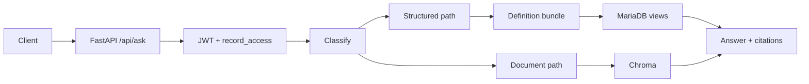
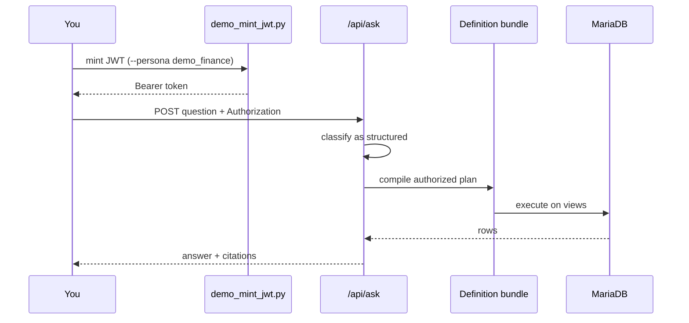

# MCP Assistant Demo

Natural-language questions over a print-shop billing database, compiled through
versioned business-definition bundles, plus grounded document Q&A with citations.

- **Structured SQL analytics** — JWT-gated queries against MariaDB views (`data/mcp_demo_v2.sql.gz`).
- **Fail-closed access** — the same question can answer for `demo_finance` and refuse for `demo_production`.
- **Grounded document Q&A** — retrieve from the bundled handbook and cite sources.

## Architecture



The product path is structured query: classify → compile against the vendored
bundle → execute on MariaDB. Document retrieval is the companion path when the
question is handbook-shaped.

## Ask flow (structured)



## Try these

| Question | Persona | Expected |
|---|---|---|
| How many invoices in July 2025? | `demo_finance` | **85** |
| What was the collection rate in July 2025? | `demo_finance` | **3.5%** |
| What was the collection rate in July 2025? | `demo_production` | refusal — no `3.5%` / figures |
| How many paid time off days do full-time staff accrue per year? | `demo_finance` | **18 days** (handbook) |

## Demo video

<!-- add URL after recording -->

## Quick start

1. Clone this repository.
2. Copy `.env.example` to `.env` and set `MODEL_API_KEY` / `BASE_URL`.
3. Start the stack:

   ```powershell
   docker compose up --build --wait
   ```

4. Open interactive docs: [http://localhost:8000/docs](http://localhost:8000/docs)
5. Ingest the handbook corpus:

   ```powershell
   python scripts/deploy/ingest.py
   ```

6. Mint a JWT (`demo_mint_jwt.py` reads `.env` automatically):

   ```powershell
   python scripts/demo_mint_jwt.py --persona demo_finance
   ```

7. Health checks:

   ```powershell
   curl http://localhost:8000/healthz
   curl http://localhost:8000/readyz
   ```

8. Ask a structured question:

   ```powershell
   $TOKEN = python scripts/demo_mint_jwt.py --persona demo_finance
   curl -X POST http://localhost:8000/api/ask `
     -H "Authorization: Bearer $TOKEN" `
     -H "Content-Type: application/json" `
     -d "{\"question\":\"How many invoices in July 2025?\"}"
   ```

## Sample response screenshot

See `docs/sample-ask.PLACEHOLDER.txt` — a `/api/ask` capture will replace this after compose smoke.

## Contributing

This tree is a generated snapshot. Do not open feature PRs here.

## License

MIT — see [LICENSE](LICENSE).
